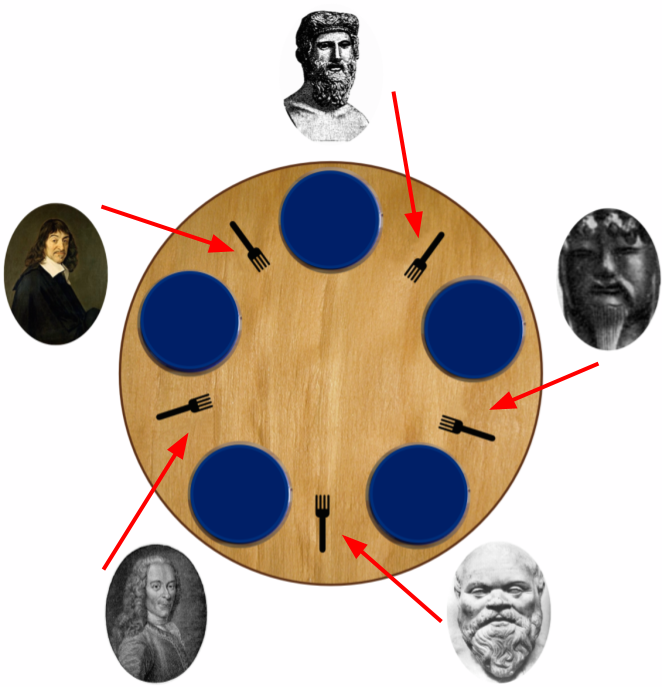

# Dining Philosophers

### Concurrent programming 1 - Lecture 5

.center[]

---
# Dining Philosophers

A classical concurrent programming problem, introduced by Edsger Dijkstra.

Philosophers are sitting at a round table, spending their time thinking and eating.

When a philosopher whishes to eat, he (she) must take the forks to his (her) immediate left and right in order to eat.

```java
while (true) {
  think();
  getForks();
  eat();
  releaseForks();
}
```

---
# A first simple solution

```java
Semaphore forks[N] = {1, 1, 1, 1, 1}; // mutex !

process Philosopher( (int id = 0; i<N; i++) ) {
  int right = id;
  int left = (id + 1) == N ? 0 : id + 1;

  while (true) {
    System.out.println("Philosopher " + id + " is thinking");

    P(forks[left]);
    P(forks[right]);

    System.out.println("Philosopher " + id + " is eating");

    V(forks[left]);
    V(forks[right]);
  }
}
```

--
### What's the problem with this solution ?

---
# Deadlocks !

.center[]

---
# Another solution

```java
Semaphore forks[N] = {1, 1, 1, 1, 1};

process Philosopher ( (int id = 0; id < N; id++) ) {
  int right = id;
  int left = (id + 1) == N ? 0 : id + 1;

  if (id == 0) {
    int temp=left;
    left=right;
    right=temp;
  }

  while (true) {
    System.out.println("Philisopher " + id + " is thinking");

    P(fork[left]);
    P(fork[right]);

    System.out.println("Philisopher " + id + " is eating");

    V(fork[left]);
    V(fork[right]);
  }
}
```

---
# Again another solution...

  Limit the number of philosophers who are allowed to eat at a given time.
  How to do that ?

--

Use a counting semaphore initialized at \(N-1\).
