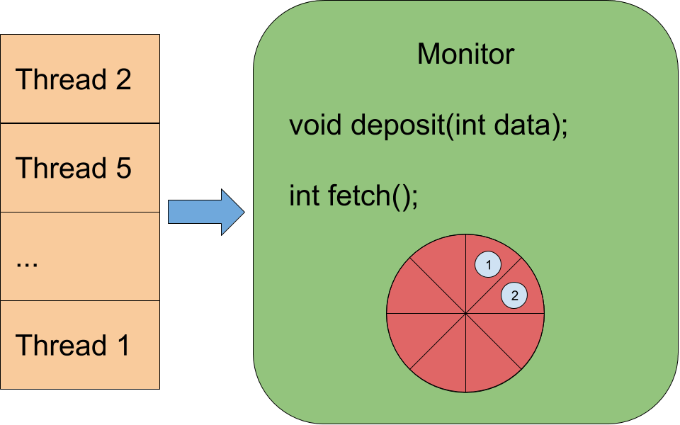

# Monitors

### Concurrent programming 1 - Lecture 9

.center[]

---
class: center,middle

<span style="font-size : 25pt;">**Concurrent Programming is hard**</span>

With semaphores, shared variables are global to all processes.

To understand a concurrent program, one needs to examine the entire program.

If a new process is added, the programmer needs to examine that the process
uses the shared variables and semaphores correctly...

and we have to do it every time we add a new process !
---
# Monitors

Monitors are program modules that provide a data abstraction mechanism :
- Encapsulate the shared data.
- Provide operations to manipulate the shared data.
- Those operations are the **only** means to access the data.
- Mutual exclusion is provided **automatically**.

Synchronization is provided through the use of condition variables,
which are used in a manner similar to semaphores.

---
# Monitors

General form if a monitor :

```java
monitor mname {

    shared monitor variables

    condition variables

    initialization code

    monitor_functions
}
```

The variables declared in the monitor are only available through the defined functions.

???

The idea behind this construct is that the variables declared in the monitor are only available through the
defined functions; therefore access is controlled, making it easier to ensure mutual exclusion for processes or
threads executing one of the monitor functions.

---
# Monitors

.center[**Only one Thread or Process at most is active inside a monitor.**]

When a Thread or Process execute a monitor functions, if someone else is already in the monitor, the process
is put into a waiting queue and has access to the monitor only when no one is active at the same time.

.center[]

---
# Condition variables

Condition variables are special variables that are used to block a thread or
process that needs to wait for some event or condition.

A process that waits on a condition variable release the exclusive access it had
while it was executing inside the monitor.

Declaration :
```java
condition c;
```

Wait on a condition :
```java
wait(c); // always block if the condition is false
         // places the process at the END of c's delay queue
```

---
# Condition variables

Since only one Thread or Process is active (at most) inside a monitor,
if a Thread has to wait inside a monitor it will release the locks of the
monitor.

Therefore, another Thread can go inside the monitor and change the state of the
monitor so waiting Threads can continue.

Signal waiting process that the state has change :
```java
signal(c);
```

If `c`'s queue is not empty, this will release the process at the front of the
delay queue. That process continues its execution at some future time in the monitor.

<span style="color:red;">⚠ it does **nothing** if the queue is empty. So if a process wait after a signal, it is block !</span>

---
# Condition variables

Now the big question becomes: when a thread signals another, who continues ?

The process that signaled, or the process that was waiting ?

--

Surely they can't both continue at the same time, since we would no longer have mutual exclusion in the monitor.

--

Different languages, monitors and environments offer different possibilities.

---
# Signal and Continue - SC

Java and Mesa say that there is no reason to block the process that signals, so
it should continue. This is called Signal and Continue (SC).

.center[]

To do it in JR :
```
> m2jr -sc monitor.jr
```

---
# Signal and Wait - SW

Concurrent Euclid and Modula say that the process that was waiting on a condition variable is the one
that gets access to the monitor. This is called Signal and Wait (SW).

.center[]

To do it in JR :
```
> m2jr -sw monitor.jr
```

---
# Signal and Urgent Wait - SU

Pascal Plus guarantees that not only should the waiting process continue, but the process that signals
should continue as soon as the awakened process either exits the monitor or waits again. This is called
Signal and Urgent Wait (SU).

.center[]

To do it in JR :
```
> m2jr -su monitor.jr
```

---
# Signal and Exit - SX

Finally, Concurrent Pascal decides that the process that signals must exit the monitor. This is called
Signal and eXit (SX).

.center[]

To do it in JR :
```
> m2jr -sx monitor.jr
```

---
# Condition variables

The wait and signal operations on condition variables are similar to the P and V operations on semaphores:
wait, like P, delays a process, and signal, like V, awakens a process. However, there are important
differences:

1. signal has no effect if there is no process delayed on the condition variable.
2. wait always delays, even if there were prior signals.

---
# Bounded buffer

```java
monitor bounded_buffer {

  int buf[N] = new int[N];      // our messages

  int front=0, rear=0, count=0; // ptrs for Cons, Prod, msgs

  condition not_full;           // signaled when count < N

  condition not_empty;          // signaled when count > 0
}
```

---
# Bounded buffer

```java
// called by Producers
void deposit(int data) {

  while (count == N) wait(not_full);

  buf[rear]= data;
  rear = ++rear % N;
  count++;

  signal(not_empty);
}
```

---
# Bounded buffer

```java
// Called by Consumers
int fetch() {

  while(count == 0) wait(not_empty);

  int o = buf[front];
  front = ++front % N;
  count--;

  signal(not_full);
  return 0;
}
```

---
# Monitors in JR

JR uses a preprocessor to translate code written in "monitor format" into JR. The processor, called m2jr is
somewhat primitive.

We can use any signals methods with it.

Reference :
`man $JR_HOME/man/m2jr.1`

---
# Bounded buffer in JR

In a file `BB.jr` :

```java
_monitor BB {

  _var int[] buf    = new int [N]; // data we want shared
  _var int   front  = 0;           // pointers for Cons, Prod resp.
  _var int   rear   = 0;
  _var int   count  = 0;           // number of messages

  _condvar not_full;               // signaled when count < N
  _condvar not_empty;              // signaled when count > 0
}
```

---
# Bounded buffer in JR

```java
// called by producers
_proc void deposit(int data) {

  while (count == N) {
    _wait(not_full);
  }

  buf[rear] = data;
  rear = (rear+1) % N;
  count++;

  _signal(not_empty);
}
```

---
# Bounded buffer in JR

```java
// called by consumers
_proc int fetch() {

  while (count == 0) {
    _wait(not_empty);
  }

  int result = buf[front];
  front = (front+1) % N;
  count--;

  _signal(not_full);
  _return result;
}
```

---
# Bounded buffer in JR

Transform the monitor into a JR class (with signal and wait):
```
m2jr -sw BB.jr
```

Use it as a standard Java class:

```java
public class BBMain {
  private static final int N = 6;
  private static BB bb = new BB("bb");
  public static void main(String[] args) {}

  private static process prod( (int i = 1; i <= N; i++) ) {
    System.out.println(i + " prod before");
    bb.deposit(i);
    System.out.println(i + " prod after");
  }

  private static process cons( (int i = 1; i <= N; i++) ) {
    System.out.println(i + " cons before");
    int got = bb.fetch();
    System.out.println(got);
    System.out.println(i + " cons after");
  }
}
```
