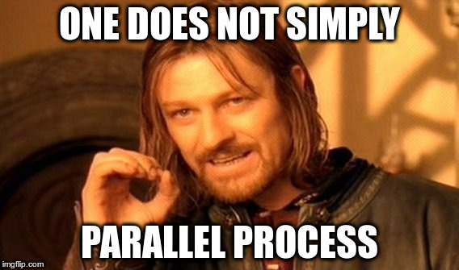

# Additional Operations on Condition Variables

### Concurrent programming 1 - Lecture 10

.center[]

---
class: center,middle

Some implementations offer additional operations on condition variables, which simplify some types of algorithms.

---
# Empty(c)

```java
empty(c);
```

returns true if there are no processes waiting on `c`;

---
# Wait(c,rank)

With wait and signal defined, delayed processes are normally awakened in the order in which they delayed, in other words, in first-in, first-out order.  Some implementations offer a priority wait, where processes are placed in the queue according to some priority.

```java
wait(rank,c);
```

where rank is an integer value representing a priority, the lower the value of rank, the higher the priority.
---
# Shortest Job Next

```java
monitor SJN {
  bool free = true;
  Condition turn ;

  void request(int time) {
    if (free) free=false;
    else wait(turn, time);
  }

  void release(void) {
    if (empty(c)) free=true;
    else signal(turn);
  }
}
```

---
# Minrank(c)

With this priority wait, it is sometimes useful to know the rank of the first process in the queue. Assuming that the queue is not empty and all the wait statements are priority wait statements.

```java
minrank(c);
```

is a function that returns the rank of the first process delayed on `c`.  If the queue associated with `c` is empty, the value of minrank is typically useless.

---
# Signal_all(c)

Typically in environments that support Signal and Continue semantics, there is an operation that allows a process to awaken all those waiting on a condition.  This is called

```java
signal_all(c);
```

Each awakened processes continues execution in the monitor at some future time.  Of course, mutual exclusion is still guaranteed by the monitor.  The effect of `signal_all` is the same as

```java
while (! empty(c)) signal(c);
```

---
# Example

Here is an example where we implement a timer monitor.  This is a utility that is often provided in operating systems to enable users to to do such things as periodically execute commands.

Our monitor has two operations, delay(interval) that processes call to wait interval time units.  Another operation will be tick(), which we will assume is called by a process that is periodically awakened by a hardware timer.  There could be other operations defined as well, for example to return the current time.

---
# Example

```java
monitor timer {
  int tod=0;        ; // Time Of Day, simply a counter
  Condition check   ; // signaled when tod increases

  void delay(int interval) {
    int wake_time = tod + interval;
    while(wake_time > tod) wait(check);
  }

  void tick(void) {
    tod++;
    signal_all(check);
  }
}
```

---
# Example

We see a sample usage of `signal_all`, which forces each process to wake up, and check to see if it is time to continue, or go back to sleep.  Of course in this particular case, this not very efficient, especially if processes are calling delay to wait for long periods of time.

By using priority wait, however, we can transform this solution into one that is equally simple, yet efficient.  Essentially, we don't need to wake up each process every time, and we don't want to wake them up in the order in which they arrive.

```java
monitor timer {
  int tod=0;                      // Time Of Day, simply a counter
  Condition check;                // signaled when tod increases

  void delay(int interval) {
    int wake_time = tod + interval;
    if (wake_time > tod) wait(check, wake_time);
  }

  void tick(void) {
    tod++;
    while (! empty(check) && minrank(check) <= tod)
    signal(check);
  }
}
```

Here the use of minrank helps tremendously.

---
# Implementing Monitors with semaphores

To implement a monitor with semaphores, we need to provide mutual exclusion and synchronization via condition variables.

What do we need to implement a monitor ?

--

- a semaphore for mutual exclusion
- for each condition variable, a semaphore
- a counter to know if some processes are waiting on the condition

---
# Implementing Monitors with semaphores

```java
Semaphore e = 1; // mutual Exclusion
Semaphore c = 0; // simulate Condition variable
Semaphore u = 0; // Urgent queue, SU only
int nc = 0;      // Number of processes waiting on Condition
int nu = 0;      // Number waiting on Urgent q, SU only
```

* Signal and Continue
* Signal and Wait
* Signal and Urgent Wait
* Signal and Exit

- Monitor entry
- Monitor exit
- signal(c)
- wait(c)
- empty(c)
