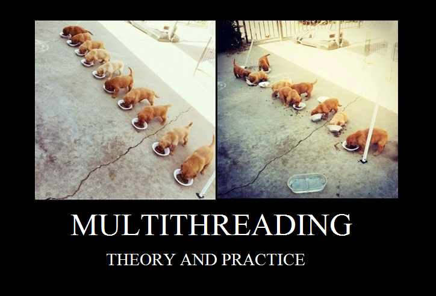

# Monitors in Java and the Sleeping Barber problem

### Concurrent programming 1 - Lecture 11

.center[]

---
# Monitors in Java

In Java, a monitor is associated with each created object, that's why we can `synchronized` on
any object on the JVM...

```java
Object o = new Object();
synchronized(o) {i++;}
```

--

When we declare a `synchronized` method, the monitors is `this`.

```java
public class Bank {
  private int balance;

  public Bank(int initialBalance) {
    this.balance = initialBalance;
  }

  public synchronized void deposit(int amount);

  public synchronized void withdraw(int amount);
}
```
---
# Bank monitor in JR

```java

_monitor Bank {

  _var int balance;
  _condvar enoughMoney;

  public Bank(int initialBalance) {
    this.balance = initialBalance;
  }

  _proc void deposit(int amount) {
    balance += amount;
    _signal(enoughMoney);
  }

  _proc void withdraw(int amount) {
    while(balance < amount) _wait(enoughMoney);
    balance -= amount;
  }
}
```
---
# Bank monitor in Java

```java
public class Bank {
  private int balance;

  public Bank(int initialBalance) {
    this.balance = initialBalance;
  }

  public synchronized void deposit(int amount) {
    notifyAll(); // or notify();
    balance += amount;
  }

  public synchronized void withdraw(int amount) {
    while(balance < amount) {
      try { wait(); }
      catch(InterruptedException e) { /*...*/ }
    }
    balance -= amount;
  }
}
```
---
# Monitors in Java

- `notify()` only wake up one process (<span style="color:red;">randomly</span>), be careful !
- `notifyAll()` wake up all processes.
- `wait()` always pauses the thread, even if prior `notify` happens.


- Java only offer the **Signal and Continue** `SC` semantics.

--

What about the condition variables ?

--

An object is a condition variable, but a Thread has to own the object in order to perform a `signal()`. So we can only
have one condition variable when we use only simple `Object`.

---
# How to have multiple condition variables ?

```java
public class BoundedBuffer {

  public final static int N = 10;

  private int front = 0;
  private int rear = 0;
  private int count = 0;
  private int[] buffer = new int[N];

  private ReentrantLock mutex = new ReentrantLock(true);
  private Condition notFull = mutex.newCondition();
  private Condition notEmpty = mutex.newCondition();
}
```
---
# How to have multiple condition variables ?

```java
public void deposit(int data) {

  mutex.lock();

  try {
    while (count == N) notFull.await();
  } catch (InterruptedException e) {
    System.err.println(e.getMessage());
  }

  buffer[rear] = data;
  rear = ++rear % N;
  count++;
  System.out.println("deposit of " + data);

  notEmpty.signal();
  mutex.unlock();
}
```

---
# How to have multiple condition variables ?

```java
public int fetch() {

  mutex.lock();

  try {
    while (count == 0) notEmpty.await();
  } catch (InterruptedException e) {
    System.err.println(e.getMessage());
  }

  int data = buffer[front];
  front = ++front % N;
  count--;
  System.out.println("fetch of " + data);

  notFull.signal();
  mutex.unlock();
  return data;
}
```

---
# Condition variables in Java

* You have to use a `Lock` variable in order to construct some condition variables, that's because a `Condition` is <span style="color:red;">always</span> associated with a `Lock`.

* When a `wait()` or `signal()` kind of method is invoked on a `Condition` object, it automatically take care of the `Lock.lock()` and `Lock.unlock()` semantics.

* A `Condition` associated with a `Lock` is always fair and offer a FIFO semantics.

* <span style="color:red;">⚠</span> use the associated `Lock` to mutually exclude Threads inside a monitor.

---
class: middle

.center[]

Imagine a barber shop with one Barber. The barber has one barber's chair in a cutting room and a waiting room containing a number of chairs in it.

When the barber finishes cutting a customer's hair, he dismisses the customer and goes to the waiting room to see if there are others waiting. If there are, he brings one of them back to the chair and cuts their hair. If there are none, he returns to the chair and sleeps in it.

Each customer, when they arrive, looks to see what the barber is doing. If the barber is sleeping, the customer wakes him up and sits in the cutting room chair. If the barber is cutting hair, the customer stays in the waiting room. If there is a free chair in the waiting room, the customer sits in it and waits their turn. If there is no free chair, the customer leaves.

---
# Sleeping Barber problem in Java

Now it is our turn to do it !

---
# Sleeping Barber problem in Java (some hints)

```java
public class BarberShop {
   final Lock lock = new ReentrantLock(true);

  //...
}
```

---
# Sleeping Barber problem in Java (some more hints)

```java
public class BarberShop {  
   final Lock lock = new ReentrantLock(true);
   final Condition bAvail = lock.newCondition();      
        // signaled when barber > 0
   final Condition chOccupied = lock.newCondition();  
        // signaled when chair > 0
   final Condition dOpen = lock.newCondition();       
        // signaled when open > 0
   final Condition cuLeft = lock.newCondition();     
        // signaled when open = 0

   int barber = 0,    // inc by barber when he's ready
       chair = 0,     // inc by customer when sitting in chair
       open = 0;      // inc by barber, dec by cust. when leaving


  //...
}
```

---
# Sleeping Barber problem in Java (even some more hints)

* Barber process
* Client processes

.center[]

---
# Sleeping Barber problem in Java (even some more hints)

```java
public class BarberShop {  
   final Lock lock = new ReentrantLock(true);
   final Condition bAvail = lock.newCondition();      // barber > 0
   final Condition chOccupied = lock.newCondition();  // chair > 0
   final Condition dOpen = lock.newCondition();       // open > 0
   final Condition cuLeft = lock.newCondition();      // open = 0

   int barber = 0,    // inc by barber when he's ready
       chair = 0,     // inc by customer when sitting in chair
       open = 0;      // inc by barber, dec by cust. when leaving

   // called by customers
   public void getHaircut() { 
      lock.lock();
      ....
   }
   // called by the barber
   public void getNextCustomer() {
      lock.lock();
      ...
   }
   // called by the barber
   public void finishedCut() {
      lock.lock();
      ...
   }
}
```